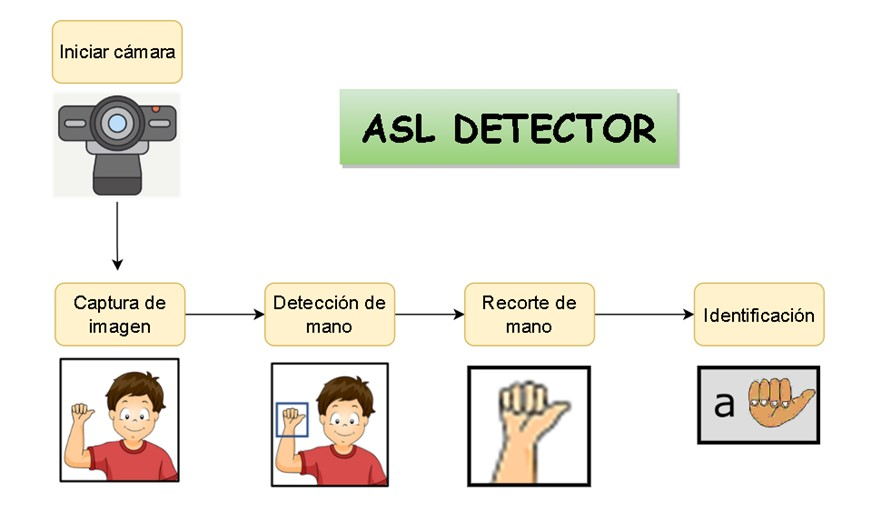

<h2 align="center">
<p>ASL DETECTOR 🔤 👆🏻</p>
</h2>

<h2 align="center">
<p></p>


<p></p>
</h2>


Aplicación que utiliza las redes neuronales convolucionales para detectar el alfabeto del lenguaje de señas en tiempo real a través de la cámara de nuestra computadora, el cual al detectar la seña nos presenta en la pantalla el nombre de la letra detectada.  


## 🌀 Pipeline
Pipeline:


## 📃 Contenido
El siguiente árbol muestra la estructura de la aplicación:

```
.
├── image
│   └── ASL_detector.jpg
├── data
├── processed
├── dataset.py
├── hand.py
├── inference.py
├── model.py
├── processed.py
├── README.md
└── train.py
```


## 👩‍💻 Maintainers
* Gabriela Colque, Github: [GabrielaC16](https://github.com/GabrielaC16/) Email: gabriela.colque.u@uni.pe