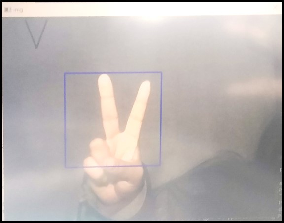
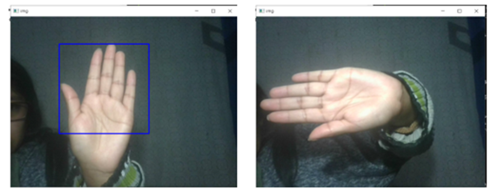
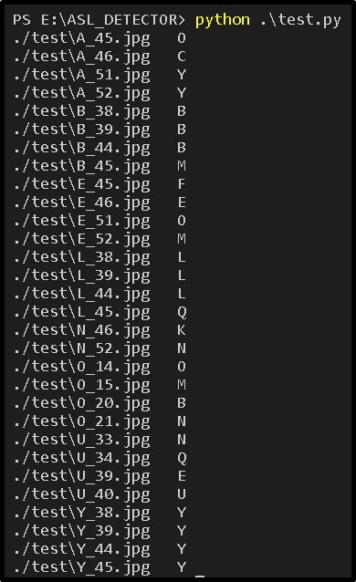

<h2 align="center">
<p>ASL DETECTOR 🔤 👆🏻</p>
</h2>

<h2 align="center">
<p></p>


<p></p>
</h2>


Aplicación que utiliza las redes neuronales convolucionales para detectar el alfabeto del lenguaje de señas en tiempo real a través de la cámara de nuestra computadora, el cual al detectar la seña nos presenta en la pantalla el nombre de la letra detectada.


## 🌀 Pipeline
Pipeline:


## 📃 Contenido
El siguiente árbol muestra la estructura de la aplicación:

```
.
├── image
│   └── graphics
│   └── ASL_detector.jpg
├── test
├── weights
├── dataset.py
├── Hand_haar_cascade.xml
├── hand.py
├── index_to_letter.py
├── inference.py
├── model.py
├── processed.py
├── README.md
├── test.py
└── train.py
```


## Train models

* Nota: El conjunto de weights que se utilizó esta disponible [aquí](https://drive.google.com/drive/folders/1w75Ry2WM1Hjl76cmOCGK77f94eXYaeDg?usp=sharing)

## Dataset

* Nota: El conjunto de datos que se utilizó esta disponible [aquí](https://drive.google.com/drive/folders/1btBxUFKBZpr9-mb7U5dhPsErXabo1NBk?usp=sharing)

## Ejecución
Si se desea probar el trabajo, necesita mover a directorios y posicionarse con ``` ASL_DETECTOR/ ``` y ejecutar este comando

```
python inference.py
```

a continuación una demostración de este trabajo.

>

## Conclusiones

### Contras ###
A raiz del proceso del proyecto se ha podido encontrar deficiencias, ya sea en el archivo clasificador para detectar las manos, por ejemplo este no detecta la mano en horizontal y este ha sido un gran problema para que pueda detectar ciertas letras, o en el ambiente para los datos, se necesita un ambiente claro e iluminado.

>

### Mejoras ###
Para la mejora del proyecto se podría aumentar más datos tanto para entrenar como para validar, además de usar un mejor archivo clasificador. 

* Este proyecto se esta realizando con 25 para entrenar y 15 para validar

A continuación los resultados de test

>


## 👩‍💻 Maintainers
* Gabriela Colque, Github: [GabrielaC16](https://github.com/GabrielaC16/) Email: gabriela.colque.u@uni.pe   